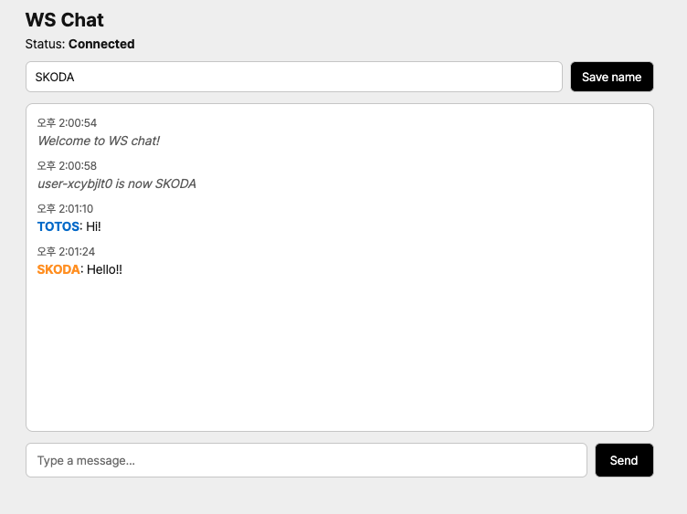

# WS Chat (React + Vite + TypeScript)

**언어 / 言語:** [한국어](#한국어) | [日本語](#日本語)

---

## 한국어

간단한 WebSocket 채팅 데모입니다. 프론트엔드는 React + Vite + TypeScript, 백엔드는 Node.js(`ws`)로 구성되어 있으며, 실시간 메시지 전송과 사용자 이름 설정을 지원합니다.

### 스크린샷

| 매인 화면                          |
| ---------------------------------- |
|  |

### 주요 기능

- **실시간 채팅**: 모든 연결된 클라이언트에 메시지 브로드캐스트
- **사용자 이름 설정**: 상단 입력란에서 닉네임 변경 가능
- **시스템 메시지**: 입장/퇴장 및 이름 변경 시 알림 표시

### 요구사항

- Node.js 18+ (권장)
- npm

### 설치

```bash
npm install
```

### 실행

**프론트엔드와 서버 동시 실행 (권장):**

```bash
npm run dev:all
```

- 프론트엔드: `http://localhost:5173`
- WebSocket 서버: `ws://localhost:3001`
- 테스트용 포트 변경 시: `npm run dev -- --port 포트번호`

**각각 별도 실행:**

- 터미널 1 (프론트엔드):
    ```bash
    npm run dev
    ```
- 터미널 2 (WebSocket 서버):
    ```bash
    npm run dev:server
    ```

### 빌드 및 프리뷰

```bash
npm run build
npm run preview
```

### 환경 변수

| 변수명    | 설명                     | 기본값 |
| --------- | ------------------------ | ------ |
| `WS_PORT` | WebSocket 서버 포트 번호 | 3001   |

예시:

```bash
WS_PORT=4000 npm run dev:server
```

클라이언트는 기본적으로 현재 호스트의 `3001` 포트에 연결합니다. 서버 포트를 바꿨다면 `src/App.tsx`의 `port` 값을 같은 값으로 수정하세요.

### 폴더 구조 (요약)

| 경로                        | 설명                           |
| --------------------------- | ------------------------------ |
| `server/server.mjs`         | WebSocket 서버 엔트리          |
| `src/`                      | React 앱 소스                  |
| `src/App.tsx`               | 메인 앱 및 WebSocket 포트 설정 |
| `src/hooks/useWebSocket.ts` | WebSocket 커스텀 훅            |

### 사용 방법

1. 앱 접속 후 **상단 입력란**에 사용자 이름을 입력해 저장합니다.
2. **하단 입력창**에 메시지를 입력하고 전송합니다.
3. 다른 브라우저 탭이나 창을 열어 여러 사용자 간 실시간 메시지 브로드캐스트를 확인할 수 있습니다.

---

## 日本語

React + Vite + TypeScript と Node.js（`ws`）を使ったシンプルな WebSocket チャットデモです。リアルタイムメッセージ送信とユーザー名の設定に対応しています。

### スクリーンショット

| メイン画面                          |
| ----------------------------------- |
|  |

### 主な機能

- **リアルタイムチャット**: 接続中の全クライアントにメッセージをブロードキャスト
- **ユーザー名設定**: 画面上部の入力欄でニックネームを変更可能
- **システムメッセージ**: 入退室や名前変更時に通知を表示

### 必要環境

- Node.js 18+（推奨）
- npm

### インストール

```bash
npm install
```

### 実行

**フロントエンドとサーバーを同時に起動（推奨）:**

```bash
npm run dev:all
```

- フロントエンド: `http://localhost:5173`
- WebSocket サーバー: `ws://localhost:3001`
- ポート変更する場合: `npm run dev -- --port ポート番号`

**個別に起動する場合:**

- ターミナル 1（フロントエンド）:
    ```bash
    npm run dev
    ```
- ターミナル 2（WebSocket サーバー）:
    ```bash
    npm run dev:server
    ```

### ビルドとプレビュー

```bash
npm run build
npm run preview
```

### 環境変数

| 変数名    | 説明                       | 既定値 |
| --------- | -------------------------- | ------ |
| `WS_PORT` | WebSocket サーバーのポート | 3001   |

例:

```bash
WS_PORT=4000 npm run dev:server
```

クライアントはデフォルトで現在のホストの `3001` 番ポートに接続します。サーバーのポートを変更した場合は、`src/App.tsx` の `port` を同じ値に合わせてください。

### フォルダ構成（概要）

| パス                        | 説明                                |
| --------------------------- | ----------------------------------- |
| `server/server.mjs`         | WebSocket サーバーエントリ          |
| `src/`                      | React アプリのソース                |
| `src/App.tsx`               | メインアプリと WebSocket ポート設定 |
| `src/hooks/useWebSocket.ts` | WebSocket カスタムフック            |

### 使い方

1. アプリにアクセスし、**画面上部の入力欄**でユーザー名を入力して保存します。
2. **下部の入力欄**にメッセージを入力して送信します。
3. 別のブラウザタブやウィンドウを開くと、複数ユーザー間のリアルタイムメッセージ配信を確認できます。
